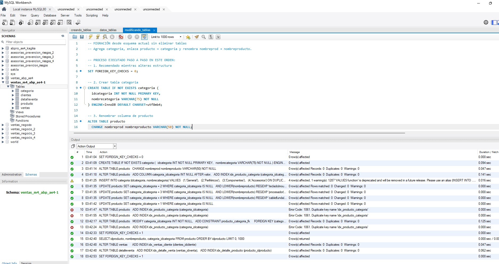

**_<h1 align="center">:vulcan_salute: Base de Datos Ventas M4_ABP_AE4-1:computer:</h1>_**


**<h3>:blue_book: Contexto de la Actividad:</h3>**

<p>Este ejercicio es la continuación de los ejercicios individuales del día anterior</p>
<p>Un negocio minorista desea llevar registro de las ventas diarias realizadas. Hasta hace un tiempo, el modelo de datos que tenían era el siguiente:</p>


<p>Después de una serie de cambios, ha quedado de la siguiente manera:</p>


**<h3>:orange_book: Requerimientos:</h3>**

<p>Se solicita que desarrolle un conjunto de sentencias SQL que permita pasar desde el modelo de datos original al modelo de datos actualizado, utilizando las consultas vistas en la clase. No es necesario que sea solo una consulta, lo puede hacer en base a una transacción que tenga un inicio y fin determinados, con consultas independientes, pero que forman parte de un conjunto mayor de instrucciones.</p>
<p>Considere que se piden solo las consultas de actualización, no el modelo completo.</p>
<p><b>Nota:</b> No se permite la eliminación y posterior creación de tablas; puede eliminar o modificar campos de una tabla.</p>

**<h3>:green_book: Construcción de la Base de Datos Original:</h3>**

<p>Creando la base de datos con las tablas ventas, clientes, detalleventa y producto:</p>

```SQL
CREATE TABLE clientes (
  idcliente INT PRIMARY KEY NOT NULL,
  nombres   VARCHAR(50) NOT NULL,
  apellidos VARCHAR(50) NOT NULL,
  direccion VARCHAR(70),
  telefono  INT
);

CREATE TABLE producto (
    idproducto INT PRIMARY KEY NOT NULL,
    nombreprod VARCHAR(50) NOT NULL,
    valor INT NOT NULL
);

CREATE TABLE ventas (
  idventa INT PRIMARY KEY NOT NULL,
  vendedor VARCHAR(50),
  cantarticulos INT NOT NULL,
  subtotal INT NOT NULL,
  impuesto INT NOT NULL,
  total INT NOT NULL,
  clientes_idcliente INT NOT NULL,
  FOREIGN KEY ( clientes_idcliente ) REFERENCES clientes ( idcliente )
);

CREATE TABLE detalleventa (
    ventas_idventa INT NOT NULL,
    producto_idproducto INT NOT NULL,
    cantidad INT,
    PRIMARY KEY (ventas_idventa, producto_idproducto),
    FOREIGN KEY (ventas_idventa) REFERENCES ventas(idventa),
    FOREIGN KEY (producto_idproducto) REFERENCES producto(idproducto)
);
```

**<h3>:blue_book: Consultas ejecutadas:</h3>**

<p>Modificando la base de datos migrando desde el esquema actual sin eliminar tablas:</p>
<ul>
  <li>Agregando enlazando tabla categoria,</li>
  <li>Enlazando categoria a producto</li>
  <li>Cambiando nombre de columna nombreprod a nombreproducto.</li>
</ul>

```SQL
-- PROCESO EJECUTADO PASO A PASO EN ESTE ORDEN:
-- 1. Recomendado mientras alteras estructura
SET FOREIGN_KEY_CHECKS = 0;

-- 2. Crear tabla categoria
CREATE TABLE IF NOT EXISTS categoria (
  idcategoria INT NOT NULL PRIMARY KEY,
  nombrecategoria VARCHAR(75) NOT NULL
) ENGINE=InnoDB DEFAULT CHARSET=utf8mb4;

-- 3. Renombrar columna de producto
ALTER TABLE producto
  CHANGE nombreprod nombreproducto VARCHAR(50) NOT NULL;

-- 4. Agregar FK en producto hacia categoria
-- Primero como NULL para no romper filas existentes
ALTER TABLE producto
  ADD COLUMN categoria_idcategoria INT NULL AFTER valor,
  ADD INDEX idx_producto_categoria (categoria_idcategoria);

-- 5. Insertar categorías base
INSERT INTO categoria (idcategoria, nombrecategoria) VALUES
  (1,'General'),
  (2,'Periféricos'),
  (3,'Componentes'),
  (4,'Accesorios')
ON DUPLICATE KEY UPDATE nombrecategoria = VALUES(nombrecategoria);

-- 6. Mapeo automático por palabras clave del nombre del producto (usa 'nombreprod')
UPDATE producto
SET categoria_idcategoria = 2
WHERE categoria_idcategoria IS NULL
  AND LOWER(nombreproducto) REGEXP 'teclado|mouse|monitor|audifon|impresora|scanner';

UPDATE producto
SET categoria_idcategoria = 3
WHERE categoria_idcategoria IS NULL
  AND LOWER(nombreproducto) REGEXP 'procesador|cpu|placa|mother|ram|memoria|ssd|hdd|disco|gpu|video|tarjeta';

UPDATE producto
SET categoria_idcategoria = 4
WHERE categoria_idcategoria IS NULL
  AND LOWER(nombreproducto) REGEXP 'cable|funda|adaptador|hub|soporte|estuche|base|cargador';

-- 7. Lo que no matchee, va a 'General'
UPDATE producto
SET categoria_idcategoria = 1
WHERE categoria_idcategoria IS NULL;

-- 8. vuelve NOT NULL y crea la FK
ALTER TABLE producto
  ADD INDEX idx_producto_categoria (categoria_idcategoria);

ALTER TABLE producto
  MODIFY categoria_idcategoria INT NOT NULL,
  ADD CONSTRAINT producto_categoria_fk
    FOREIGN KEY (categoria_idcategoria)
    REFERENCES categoria(idcategoria)
    ON UPDATE CASCADE
    ON DELETE RESTRICT;

SET FOREIGN_KEY_CHECKS = 1;

-- 9. Comprobación rápida
SELECT idproducto, nombreproducto, categoria_idcategoria
FROM producto
ORDER BY idproducto;

-- 10. Índices en FKs existentes para rendimiento
ALTER TABLE ventas      ADD INDEX idx_ventas_cliente (clientes_idcliente);
ALTER TABLE detalleventa
  ADD INDEX idx_detalle_venta (ventas_idventa),
  ADD INDEX idx_detalle_producto (producto_idproducto);

SET FOREIGN_KEY_CHECKS = 1;
```


**<h3>📁 Estructura del Proyecto:</h3>**

```
📁ventas_m4_abp_ae4-1
└── README.md
└── 📁img
│    ├── 📁wireframes
│    │    ├── wireframe_bbdd.jpg
│    │    └── wireframe_bbdd_v2.jpg
│    └── eer_diagram.jpg
│    └── paso_a_paso_cambios.jpg
└── 📁mysql
    ├── eer_diagram.mwb
    ├── 📁consultas
    │   └── todas_las_consultas.sql
    └── 📁tablas
        ├── insertando_datos_tablas.sql
        └── todas_las_tablas.sql
```

**<h3>:book: EER Diagram Final:</h3>**


